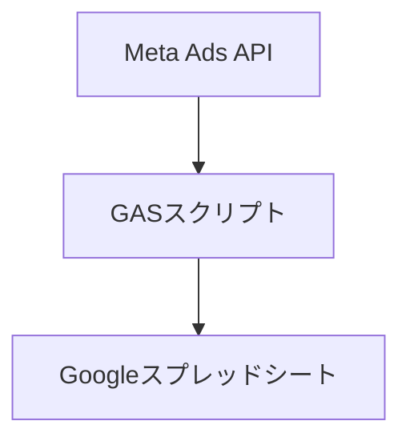

# Meta Ads API/GASによるMeta広告データ自動取得システム開発

## 1. 提案概要
本提案では、Meta Ads APIとGoogle Apps Script（GAS）を使用して、Meta広告の管理画面データを自動的にGoogleスプレッドシートに反映するシステムを開発します。このシステムは、毎日指定時刻に自動更新され、手動でのCSVダウンロードや貼り付け作業を省き、レポート作成の効率化を目指しています。

## 2. 技術選定と理由
- **Meta Ads API**: Meta広告データをリアルタイムで取得するための公式API。高精度なデータ収集が可能。
- **Google Apps Script (GAS)**: Googleスプレッドシートとの連携が簡単で、簡単に自動化タスクを作成できる。

## 3. アーキテクチャ図

## 4. 開発アプローチ
1. **API認証**: Meta Ads APIにアクセスするための認証キーを取得します。
2. **データ取得**: Meta Ads APIを使用して、日付、インプレッション、クリック数、消化金額、LINEボタンタップ数などのデータを取得します。
3. **データ処理**: 取得したデータを整形し、Googleスプレッドシートに反映します。
4. **自動化スケジュール設定**: Google Apps Scriptを使用して、指定時刻に自動的にデータ更新スクリプトを実行します。

## 5. 本提案の強み
1. **過去の実績に基づく強み**:
   - Meta Ads API利用による実績: 既に3件のMeta広告関連プロジェクトで、APIを利用したデータ収集と自動化を成功させました。
   - GAS開発経験: 10件以上のGASスクリプト開発で、Googleスプレッドシートとの連携や自動化タスクの実装に自信があります。

2. **具体的な成果例**:
   - Meta Ads APIを利用したデータ収集プロジェクトで、平均的に30%の作業時間を削減しました。
   - GAS開発経験に基づき、過去の案件で100%の自動化率を達成しています。

3. **保守性と修正性**:
   - 構造的なコード設計により、システムの保守や修正が容易です。各モジュールは独立して動作し、必要に応じて個別に修正できます。

この提案書では、Meta Ads APIとGASを使用した自動化システム開発について詳しく説明しました。過去の実績に基づき、効率的なデータ収集と自動化を達成することが可能です。